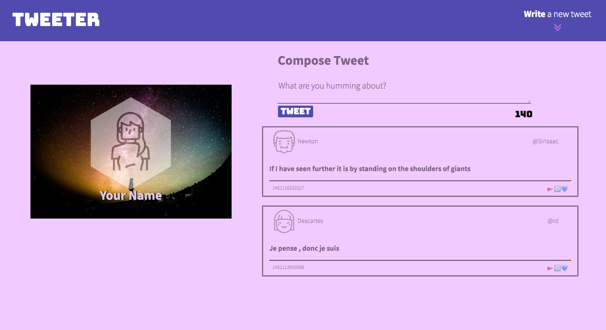
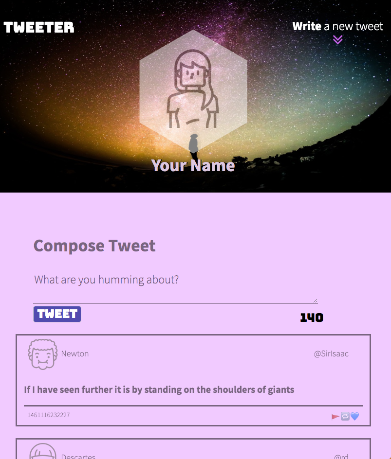

# Tweeter Project

## Table of Contents
  - [Description](#description)
  - [Final Product](#final-product)
  - [Getting Started](#getting-started)
  - [Dependencies](#dependencies)
  - [Contributions](#contributions)

## Description

Tweeter is a single-page application Twitter clone. It is designed to be fully responsive accross all viewport sizes and is built with Javascript, jQuery, CSS, HTML and Express. 

## Final Product

## Getting Started

1. Clone this repository.
2. Install dependencies using the `npm install` command.
3. Start the web server using the `npm run local` command. The app will be served at <http://localhost:8080/>.
4. Go to <http://localhost:8080/> in your browser.

## Dependencies

- Express
- Node 5.10.x or above
- chance ^1.0.2
- body-parser ^1.15.2
- md5 ^2.1.0

## Contributions
Backend starter code was served by [Lighthouse Labs](https://github.com/lighthouse-labs/tweeter)